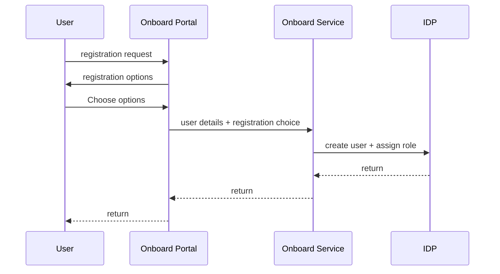
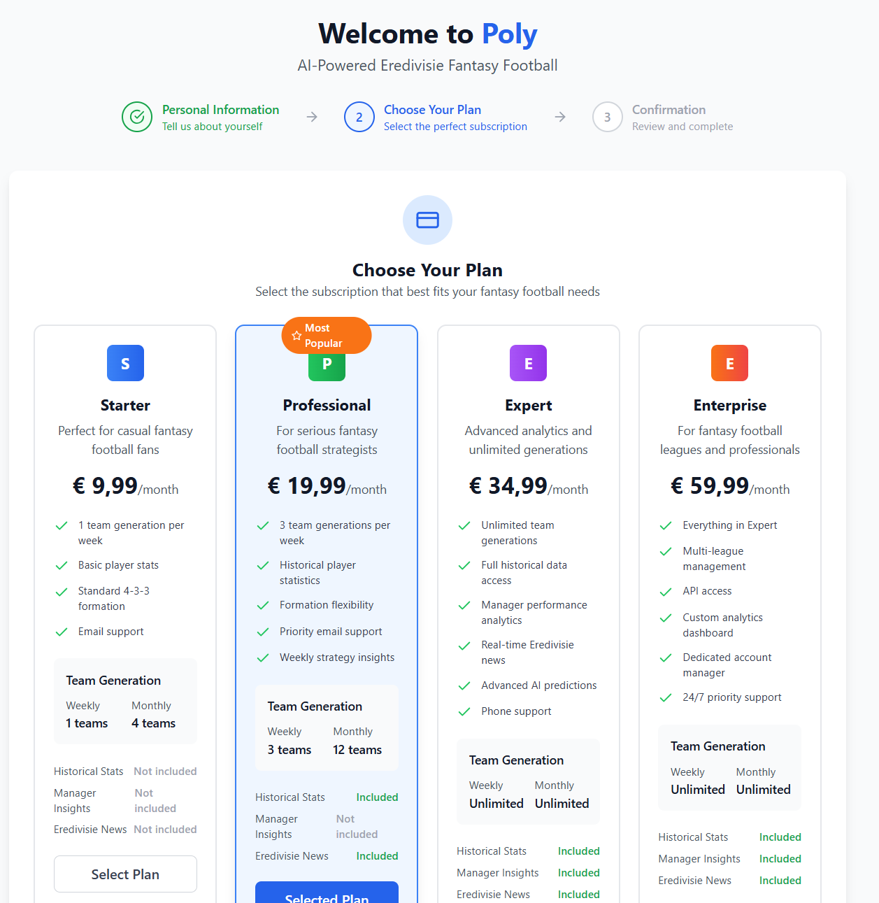
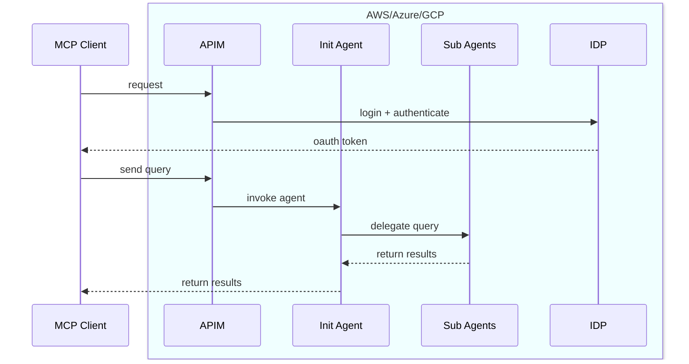
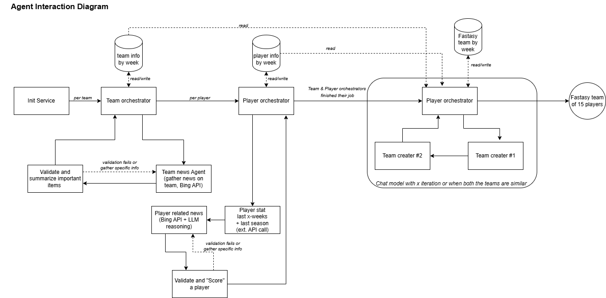
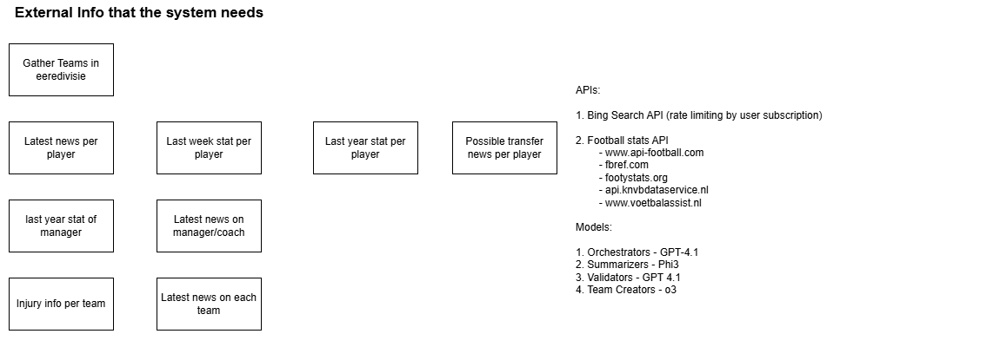

# Eeredivisie Fantasy Football - Agentic Way

### Name

The name of this system from now on in the document will be **Poly**.

### Goal
1. Every week produce a team of 15 players.
2. Team should be complete(4-3-3) with a goalkeeper.

### Requirements
1. Onboarding portal registers new users and provides user management.
2. New users needs to be onboarded/registered.
3. User should select a package/subscription.
4. Package/Subscrption defines which tools, APIs, rate-limit applies to an user.
5. Should be accessible via MCP-client(s).

### User registration flow

Subscription models would look like >>

### MCP client interaction flow

### Internal Agent interaction flow

### External info need/design choices

## Open Items

1. Cloud Infra design
2. Terraform or Bicep scripts for model deployments
3. Initial Agentic flow implementation
4. Terraform or Bicep scripts for APIM, ACA, VNet
5. Evaluation flow for models
6. Github workflow(s)